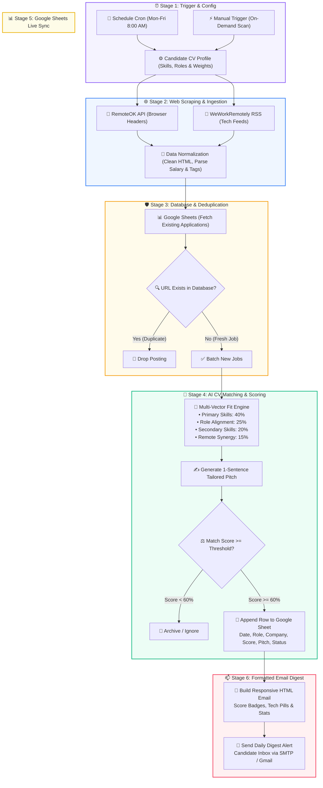

# 🎯 Automated Job Tracker & AI CV Matching Engine

[](https://n8n.io/)
[](https://sheets.google.com/)
[](https://developer.mozilla.org/)
[](https://openai.com/)
[](https://mail.google.com/)
[](https://opensource.org/licenses/MIT)

> An enterprise-grade, end-to-end autonomous job hunting pipeline built with **n8n**. It automatically scrapes remote tech career portals, filters out duplicates against a live Google Sheets database, calculates a multidimensional **AI CV Match Score (0–100%)**, generates bespoke application elevator pitches, updates a structured spreadsheet CRM, and delivers an executive **HTML daily email digest**.

---

## 🌟 Architecture Overview



---

## ⚡ Key Features

| Stage | Feature | Description |
| :--- | :--- | :--- |
| **01** | **Automated Cron Scheduling** | Runs autonomously Monday through Friday at **8:00 AM**, with a one-click manual trigger for on-demand execution. |
| **02** | **Multi-Source Scraping** | Scrapes tech job feeds (RemoteOK, WeWorkRemotely) using custom browser `User-Agent` and headers to prevent bot blocking. |
| **03** | **HTML Sanitization & Normalization** | Extracts roles, companies, locations, parsed salary brackets, tech stack tags, and converts raw HTML into clean text. |
| **04** | **Deduplication Engine** | Pulls historical job URLs from Google Sheets to ensure identical postings are never processed or emailed twice. |
| **05** | **AI CV Matching (0–100%)** | Evaluates job requirements against candidate technical profile with a weighted multi-vector scoring algorithm. |
| **06** | **Tailored Pitch Generator** | Synthesizes role requirements and candidate strengths into an instant, 1-sentence application elevator pitch. |
| **07** | **Google Sheets Live Sync** | Automatically logs qualified opportunities into a structured job tracker database with application statuses. |
| **08** | **HTML Email Digest** | Assembles and sends a luxury, mobile-responsive card layout email with visual score tags and direct apply links. |

---

## 🧮 AI Fit Scoring Engine

The CV matching algorithm calculates a deterministic **Match Quality Score (0–100%)** across 4 weighted dimensions:


```
┌───────────────────────────────────────────────────────────────────────────┐
│                          AI FIT SCORE MATRIX                              │
├───────────────────────┬────────┬──────────────────────────────────────────┤
│ Dimension             │ Weight │ Evaluation Logic                         │
├───────────────────────┼────────┼──────────────────────────────────────────┤
│ Primary Tech Stack    │ 40%    │ Exact & semantic match on core skills    │
│ Role Title Alignment  │ 25%    │ Target title keywords and seniority fit  │
│ Secondary Tech Stack  │ 20%    │ Complementary tools (Cloud, CI/CD, APIs) │
│ Remote / Work Synergy │ 15%    │ Remote eligibility & experience level    │
└───────────────────────┴────────┴──────────────────────────────────────────┘
```

### Match Priority Tiers:
- 🔥 **High Priority (80% – 100%)**: Strong technical synergy; immediate priority application.
- ⚡ **Good Fit (60% – 79%)**: Meets key requirements with minor secondary stack variance.
- ⏳ **Moderate / Low (< 60%)**: Filtered out to protect inbox quality and focus attention on top matches.

---

## 📊 Google Sheets Schema

Create a Google Sheet titled **`Job Applications`** with the following column headers in Row 1:

| Column | Header | Type | Sample Value | Description |
| :--- | :--- | :--- | :--- | :--- |
| **A** | `Date Found` | Date | `2026-08-13` | Date the job posting was discovered |
| **B** | `Company` | Text | `Stripe` | Hiring organization |
| **C** | `Role` | Text | `Senior Full-Stack Engineer` | Job title |
| **D** | `Match Score %` | Text / % | `92%` | Computed AI CV fit score |
| **E** | `Match Tier` | Text | `🔥 High Priority Match (80-100%)` | Qualitative match category |
| **F** | `Tech Stack` | Text | `React, TypeScript, Node.js, Postgres` | Extracted technologies |
| **G** | `Location` | Text | `Remote (Worldwide)` | Location or remote status |
| **H** | `Salary Range` | Text | `$140,000 - $185,000` | Listed salary or compensation |
| **I** | `Apply URL` | URL | `https://remoteok.com/j/123456` | Direct link to job posting |
| **J** | `Tailored Pitch` | Text | `Excited to apply my 3+ years of expertise...` | 1-sentence tailored application pitch |
| **K** | `Fit Reasoning` | Text | `Matched 5 key competencies. Title synergy: 25/25.` | Audit trail for scoring decision |
| **L** | `Application Status` | Select | `To Apply` / `Applied` / `Interviewing` | Kanban tracking status |

---

## 📧 Daily Email Digest Preview

When new high-match positions are identified, the workflow automatically generates and sends an executive HTML summary:

```
+-----------------------------------------------------------------------+
| 🎯 DAILY JOB MATCH DIGEST                                             |
| Thursday, Aug 13, 2026 • Curated for Candidate Name                   |
+-----------------------------------------------------------------------+
|   TOTAL MATCHES: 5    |   HIGH PRIORITY: 3    |   AVG FIT: 84%        |
+-----------------------------------------------------------------------+
| [92% MATCH • HIGH PRIORITY]                                           |
| Senior Full-Stack Engineer                                            |
| 🏢 Acme Corp  •  📍 Remote (Worldwide)  •  💰 $130,000 - $160,000     |
|                                                                       |
| 💬 Pitch: "Excited to apply my 3+ years of hands-on expertise in     |
|    React, TypeScript, and Node.js to accelerate Acme Corp's team."    |
| 🔍 Why it matches: Matched 5 key competencies. Remote confirmed.      |
| 🏷️ Stack: [React] [TypeScript] [Node.js] [PostgreSQL] [Docker]        |
|                                                                       |
| [ 👉 APPLY NOW ]                                                      |
+-----------------------------------------------------------------------+
```

---

## 🚀 Quickstart & Setup Guide

### 1. Prerequisites
- **n8n Instance**: Self-hosted (Docker / npm) or [n8n Cloud](https://n8n.io/).
- **Google Account**: Access to Google Sheets and Google Cloud OAuth2 credentials.
- **Email Account**: Gmail OAuth2 or any standard SMTP credentials.

### 2. Import Workflow into n8n
1. Open your n8n workspace.
2. Click **Workflows** > **Import from File**.
3. Select [`job_tracker_workflow.json`](./job_tracker_workflow.json).
4. The canvas will render all 14 execution nodes along with 6 color-coded sticky notes.

### 3. Configure Credentials
- **Google Sheets Node**:
  - Connect your Google OAuth2 account.
  - Set the Document ID and select Sheet Name: `Job Applications`.
- **Email Node**:
  - Connect your SMTP or Gmail credential.
  - Set the recipient email address.

### 4. Personalize Your Candidate Profile
Double-click the **`Set Candidate Profile & CV`** node to configure your details:

```javascript
const candidateProfile = {
  fullName: "Your Name",
  email: "your.email@domain.com",
  targetRoles: [
    "Full Stack Developer",
    "Software Engineer",
    "Backend Developer",
    "Frontend Developer",
    "AI / Automation Engineer"
  ],
  experienceYears: 3,
  primarySkills: [
    "JavaScript",
    "TypeScript",
    "React",
    "Next.js",
    "Node.js",
    "Python",
    "PostgreSQL",
    "REST APIs",
    "n8n",
    "Docker"
  ],
  secondarySkills: [
    "GraphQL",
    "AWS",
    "FastAPI",
    "LangChain",
    "OpenAI API",
    "MongoDB"
  ],
  preferredLocations: ["Remote", "Worldwide"],
  minScoreThreshold: 60,
  highPriorityThreshold: 80
};
```

### 5. Run & Activate
- Click **Test step** or **Execute workflow** to verify on-demand execution.
- Toggle the workflow switch to **Active** to enable automatic cron execution at 8:00 AM.

---

## 📁 Repository Structure

```
├── job_tracker_workflow.json    # Complete, production-ready n8n workflow export
└── README.md                    # Project documentation, architecture & setup guide
```

---

## 🛡️ Best Practices & Design Decisions

- **Zero-Poll Rate Limiting**: Scraper fetches only recent active postings and limits batch sizes to prevent rate limiting.
- **Resilient Fallbacks**: If salary or tech tags are omitted from a posting, the normalization engine safely defaults values without breaking downstream nodes.
- **Deterministic Deduplication**: Uses lowercase normalized URL matching to prevent duplicate application submissions across runs.
- **Configurable Thresholding**: Match criteria can be tuned in one central node without altering pipeline connections.

---

## 📄 License

Distributed under the **MIT License**. See `LICENSE` for more information.

---

<div align="center">
  <sub>Built with ❤️ using <b>n8n</b>, <b>JavaScript</b>, and <b>Automation</b>.</sub>
</div>
