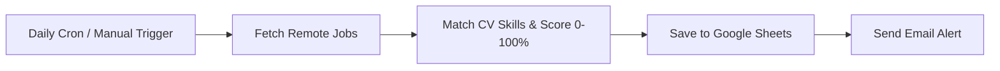

# 🎯 Automated Job Tracker & CV Matcher


A simple, automated job tracker built with **n8n**. It automatically fetches remote developer jobs, matches them against your skills, logs qualified roles to **Google Sheets**, and sends an email notification.

---

## ⚡ How It Works



---

## 📋 Features

- **Automated Schedule**: Runs every weekday (Mon–Fri at 8:00 AM) or manually on demand.
- **Job Scraping**: Fetches the latest remote developer jobs via API.
- **CV Matching**: Compares job requirements with candidate skills and computes a match score (0–100%).
- **Google Sheets Sync**: Saves new opportunities to a spreadsheet database.
- **Email Alerts**: Sends an instant email notification with job details and application links.

---

## 📊 Google Sheets Columns

Create a sheet named **`Job Applications`** with these columns in Row 1:

| Column | Header | Description |
| :--- | :--- | :--- |
| **A** | `Date Found` | Date the job was found |
| **B** | `Company` | Company name |
| **C** | `Role` | Job title |
| **D** | `Match Score %` | Skill fit score (e.g. 75%) |
| **E** | `Tech Stack` | Key technologies listed |
| **F** | `Location` | Location or remote status |
| **G** | `Apply URL` | Direct link to apply |
| **H** | `Application Status` | Default: `To Apply` |

---

## 🚀 Setup Guide

### 1. Import Workflow
1. Open **n8n**.
2. Go to **Workflows** > **Import from File**.
3. Select [`job_tracker_workflow.json`](./job_tracker_workflow.json).

### 2. Connect Credentials
- **Google Sheets**: Add your Google OAuth2 credentials and choose your spreadsheet.
- **Email**: Configure your SMTP or Gmail credentials.

### 3. Customize Your Skills
In the **`Parse & Match CV`** node, update the `targetSkills` list with your own skills:

```javascript
const targetSkills = ['react', 'node', 'javascript', 'typescript', 'python', 'sql', 'docker', 'api'];
const minScore = 50; // Minimum score to save and notify
```

### 4. Activate
Toggle the workflow to **Active** to start automatic daily runs.

---

## 📁 Repository Files

- `job_tracker_workflow.json` — n8n workflow file ready to import.
- `README.md` — Setup instructions and documentation.
